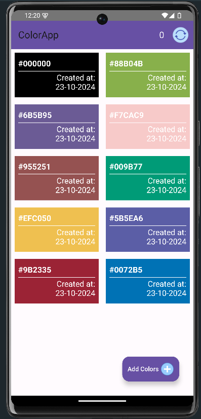

# ColorApp

<h2>Description</h2>

    <strong>ColorApp</strong> is an Android application built in Kotlin for storing and managing HEX color values, with support for syncing data across devices.

## Screenshots

<h2>Project Setup</h2>
<ol>
    <li><strong>Clone the repository:</strong>
        <pre><code>git clone https://github.com/SilvesterFernandes/colorapp.git</code></pre>
    </li>
    <li><strong>Open the project in Android Studio:</strong>
        <ul>
            <li>Open Android Studio.</li>
            <li>Select "Open an existing project" and choose the cloned directory.</li>
        </ul>
    </li>
    <li><strong>Build the project:</strong>
        <ul>
            <li>Sync the Gradle files.</li>
            <li>Build the project using the "Build" menu in Android Studio.</li>
        </ul>
    </li>
    <li><strong>Run the app:</strong>
        <ul>
            <li>Connect an Android device or use an emulator.</li>
            <li>Click the "Run" button in Android Studio.</li>
        </ul>
    </li>
</ol>

<h2>Dependencies</h2>

Add the following dependencies in your <code>build.gradle</code> file:

<pre><code>dependencies {
    implementation "org.jetbrains.kotlin:kotlin-stdlib:1.5.31"
    implementation 'androidx.core:core-ktx:1.6.0'
    implementation 'androidx.appcompat:appcompat:1.3.1'
    implementation 'com.google.firebase:firebase-database:20.0.0'  // For sync functionality
    implementation 'androidx.lifecycle:lifecycle-livedata-ktx:2.3.1'  // For LiveData
}</code></pre>

<h2>Sync Setup</h2>
<ul>
    <li><strong>Firebase</strong>: This project uses Firebase Realtime Database for synchronizing HEX colors across devices.
        <ul>
            <li>Add your <code>google-services.json</code> file in the app directory after setting up Firebase.</li>
            <li>Follow the <a href="https://firebase.google.com/docs/android/setup">Firebase setup instructions</a> to configure your Firebase project.</li>
        </ul>
    </li>
</ul>
